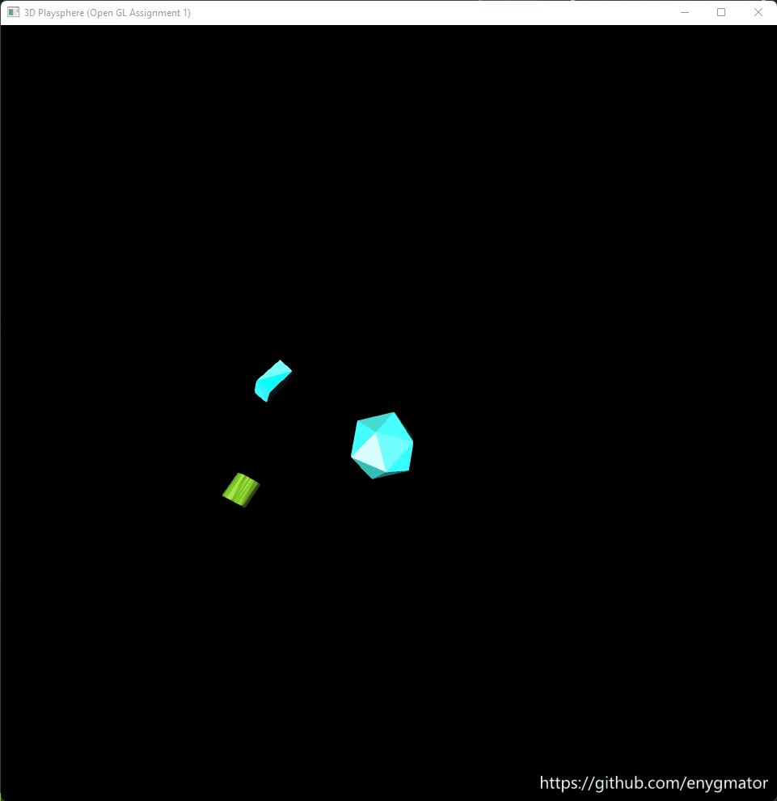

# A spherical world - OpenGL

## Download the app

If you don't want to use the code and instead directly download the application, you can just got to `releases` here on GitHub and download a binary named `A1.exe` from a release called `RC - v1`, and run it on your Windows machine. While downloading, your browser might give you a warning (since this app wasn't signed by a secure authority) which you'll have to ignore and keep the file.

## Instructions to use the application

INSTRUCTIONS:
- You will find objects moving about inside of the imagnary spherical world that hs been created.  
        What you are looking at on the screen is the camera, that is initially positioned along (1, 0, 0)  
                In order to move the camera, use the middle click button on your mouse.  
                Hold down the middle click button and move your mouse - exactly like in blender  
                > NOTE: The camera is always pointing at the center of the world (0,0,0)  
                and moves around on the surface of the world sphere.  
- By clicking on any of the objects, you can select them, which will stop them from moving.  
        Once the object is seleted, you can perform transformations on it:  
        1. To translate         the object, hit the `g` key.  
        2. To rotate    the object, hit the `r` key.  
        3. To scale     the object, hit the `s` key.  
- Once you have selected the type of transformation you want to perform,  
        use the number pad to perform the transformation :  
        1. X axis :  +ve = (6)   -ve = (4)  
        2. Y axis :  +ve = (8)   -ve = (2)  
        3. Z axis :  +ve = (1)   -ve = (9)  
        NOTE: You will not be able to translate the object beyond the boundaries of the sphere  
- IMAGINATION (10m): The object will change the hue of its color everytime you select & unselect it.  
- After that, by clicking on any other object or in the empty space, the object will continue to move.  
- The objects will bounce off of the inner surface of the sphere while it's randomly moving about.  
- They will change the hue of their color each time they bounce.  
        Note that the bouce will occur only when the CENTER of the object goes beyond the radius of the sphere.  
- The objects move and rotate randomly within the world  
- The objects that you will find in the sphere are Cuboid (b), Icosahedron (i) or Cylinder (l)  
        We will be using the representations provided in the parenthesis to refer to the objects.  
        You can show/hide the objects, using the keys b, i and l each for the objects they represent.  
- All objects are made purely of triangles, and even though all triangles belonging  
         to an object will have the same hue, each of them will have a random saturation and lightness  
        NOTE: We use the HSL color system for its practicality and then convert it to RGB.  
  
There are certain variables you can customize (in #defines):  
1. CYLINDER_SIDES - the more, the smoother the cylinder  
2. WORLD_RADIUS - radius of the world  
3. FOV - the field of view of your camera  
4. CYLINDER_HEIGHT, CYLINDER_RADIUS  
5. winX, winY - The location of the Window on your desktop  
6. winH, winW - The height and width of the window  
7. ICOSAHEDRON_SCALE - scale the icosahedron by using a scale multiplier  
8. const int DRAG - slow down the random movement and rotation speed by increasing this value  
9. float diff - The amount by which transformations are applied to the objects, when you presss the keys  
> NOTE: You can look into the code if you wish to change other constants/presets (there are MANY!)  

## Getting Started

In order to run/execute the code in this repo, you must have your Windows machine ready with the OpenGL software. You may find instructions to achieve that [Here at GeeksForGeeks](https://www.geeksforgeeks.org/how-to-setup-opengl-with-visual-studio-2019-on-windows-10/)

As of 20-Oct-21, the latest version of GLUT is [this](https://www.opengl.org/resources/libraries/glut/glutdlls37beta.zip)

## Installation, Build, Usage & Development

Once, you have your machine ready, you will need to clone this repo locally using `git` or, you may just download it.

The solution consists of many projects, each of whose name is the month and date followed by what code that project contains.

You just need to right-click on the project you want to run as click `set as startup project` and then click the "play" (Local Windows Debugger) button to debug the code. 

> Note that this repo is being developed using `Platform Tooset: Visual Studio 2022 (v143)` applied on all projects. Visual Studio 2022 is still in preview as of this date. So, when running it on Visual Studio 2019, you may have to `retarget` the projects by either right-clicking on the solution or the project and clicking `retarget solution` or `retarget project` respectively (The deafult values to retarget will be chose for you).

> If you get an error while building, saying `cannot open file glut32.lib`, then make sure that the configuration you are using is set to `Debug|x86`. If you encounter any other `OpenGL` related problems make sure you installed the stuff properly.

## LICENSE

It has the MIT License (very permissive). Check the license file for details.
